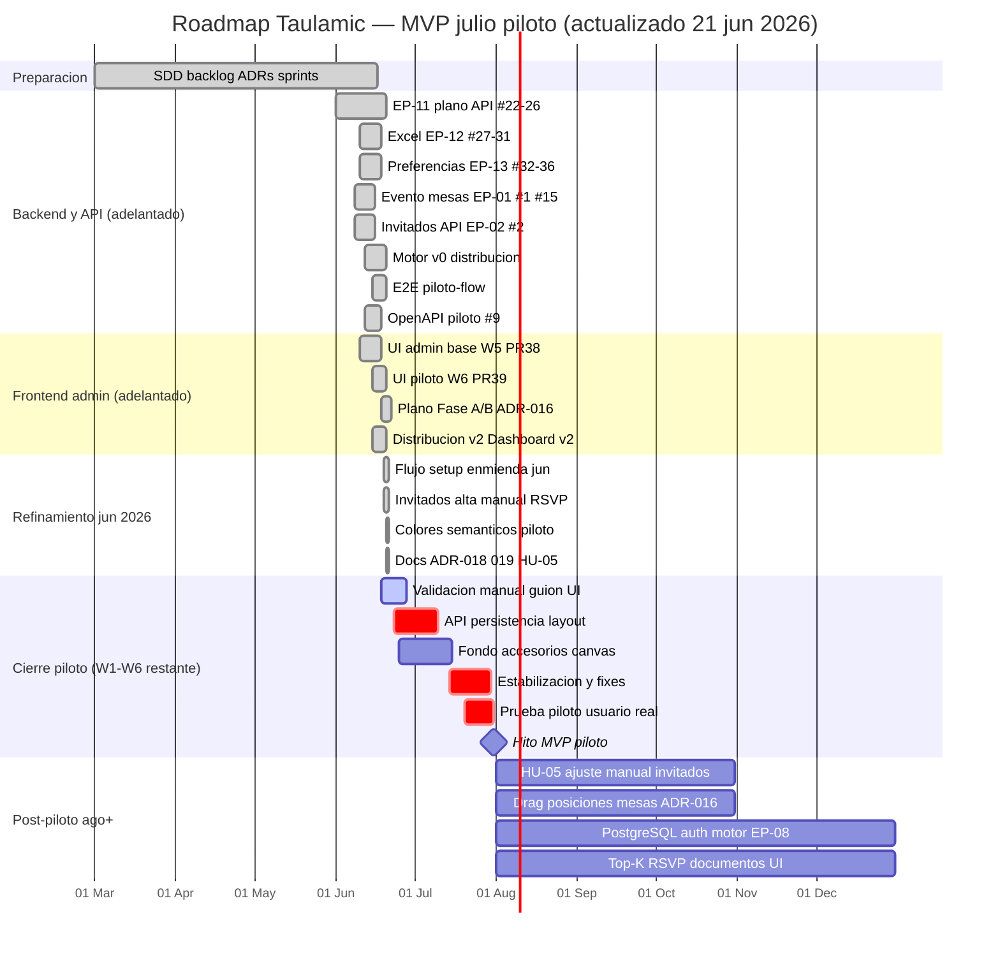
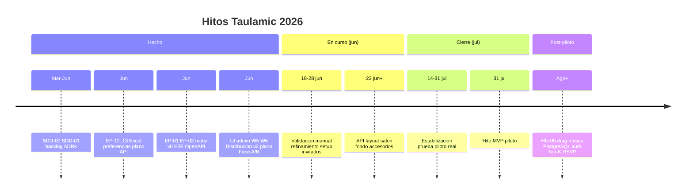
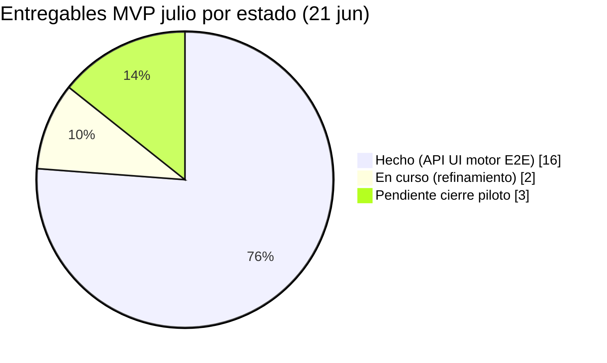

# Roadmap MVP julio — Vista grafica

> **Hoy:** 21 jun 2026 · **Hito piloto:** 31 jul 2026 · **Decision:** [DECISION-002](DECISION-002-mvp-julio-piloto-funcional.md)  
> Plan detallado: [mvp-julio-plan.md](mvp-julio-plan.md) · Estado operativo: [CONTEXTO-EJECUCION.md](CONTEXTO-EJECUCION.md)  
> Commits referencia: `010cbae` (refinamiento UI piloto) · `10da7d5` (docs HU-05)

## Donde estamos ahora

```
Mar 2026          Jun 2026                              Jul 2026              Ago+
|---- SDD/backlog ----|-- entrega nucleo piloto --|-- cierre y prueba --|-- SDD completo --|
                       ^^^^^^^^^^^^^^^^^^^^^^^^^^^
                       EP-11..13 API UI motor E2E HECHO
                                              ^^^^^^^^^
                                         refinamiento + hito 31 jul
```

| Indicador | Valor |
|-----------|-------|
| **Posicion temporal** | Semana 1 de 6 (18–22 jun) — **nucleo piloto adelantado** |
| **Foco actual** | Refinamiento UX setup/plano/invitados; validacion manual; huecos documentados |
| **EP-11 / EP-12 / EP-13** | **Cerrados** (#22–#36) |
| **EP-01 / EP-02 / motor v0 / E2E / UI W5–W6** | **Cerrados** (PR #37–#39 + commits jun 2026) |
| **Progreso piloto (nucleo funcional)** | **~85 %** — flujo demostrable en `main` |
| **Dias hasta piloto** | 40 dias |

**Estado por color:** `HECHO` · `EN CURSO` · `PLANIFICADO` · `POSPILOTO`

---

## Diagrama Gantt (MVP julio)

Copia o visualiza este bloque en GitHub, VS Code o [mermaid.live](https://mermaid.live).



---

## Linea de tiempo por fases



---

## Matriz semanal (estado vivo)

| Semana | Fechas | Entregable clave | Estado |
|--------|--------|------------------|--------|
| **W1** | 18–22 jun | Nucleo piloto + refinamiento UX | **EN CURSO** — nucleo **HECHO**; pulido activo |
| W2 | 23–29 jun | API layout salon; fondo/accesorios | Planificado |
| W3 | 30 jun – 6 jul | Cierre huecos plano; checklist setup | Planificado |
| W4 | 7–13 jul | Estabilizacion integracion | Planificado |
| W5 | 14–20 jul | Prueba piloto interna | Planificado |
| W6 | 21–31 jul | Fixes finales; demo usuario real | Planificado |
| Post | ago 2026+ | MVP SDD completo | Pospuesto (SDD intacto) |

---

## Progreso por bloque funcional



| Bloque | Issues / ambito | Hecho | En curso | Pendiente |
|--------|-----------------|-------|----------|-----------|
| Plano EP-11 | #22–#26 + ADR-016 UI | 5 + Fase A/B | — | API layout, fondo, drag accesorios |
| Excel EP-12 | #27–#31 | 5 | — | — |
| Preferencias EP-13 | #32–#36 | 5 | — | Motor afinidad real (post-piloto) |
| Evento EP-01 | #1, #15 | 2 | — | — |
| Invitados EP-02 | #2 + UI manual | 1 + UI | refinamiento UX | — |
| Distribucion piloto | motor v0, E2E | 2 | — | HU-05 manual (post-piloto) |
| UI admin | W5 + W6 + jun 2026 | 1 + refinamiento | validacion manual | — |
| Docs gobernanza | ADR-016 018 019 HU-05 | 4 | — | — |

---

## Dos niveles de MVP (referencia rapida)

| Nivel | Fecha objetivo | Que incluye |
|-------|----------------|-------------|
| **MVP julio (piloto)** | **31 jul 2026** | Admin: plano + Excel + evento + invitados + motor v0 + UI minima — **nucleo en `main`** |
| **MVP SDD completo** | Post-piloto | Todo `SDD-01-borrador-mvp.md` — sin rebaja de requisitos |

---

## Como mantener el roadmap al dia

1. Al cerrar una issue GitHub o merge relevante, actualizar la matriz semanal y barras `done` del Gantt.
2. Sincronizar foco activo con [CONTEXTO-EJECUCION.md](CONTEXTO-EJECUCION.md).
3. Si cambia el calendario, editar primero `mvp-julio-plan.md` y luego este archivo (fechas Gantt).
4. Cumplimiento piloto vs SDD-01: `docs/sdd/SDD-PILOTO-alineacion-y-huecos.md`.
