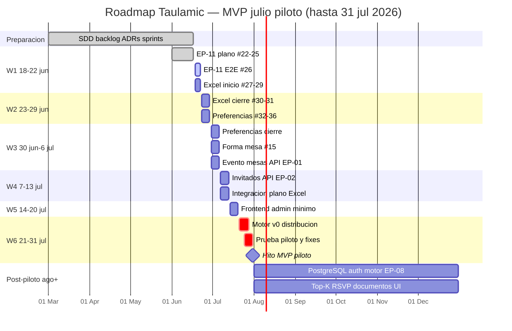
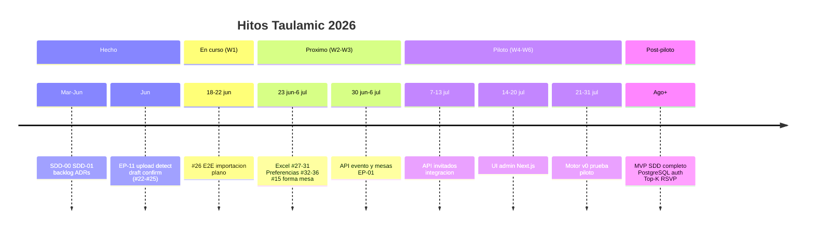
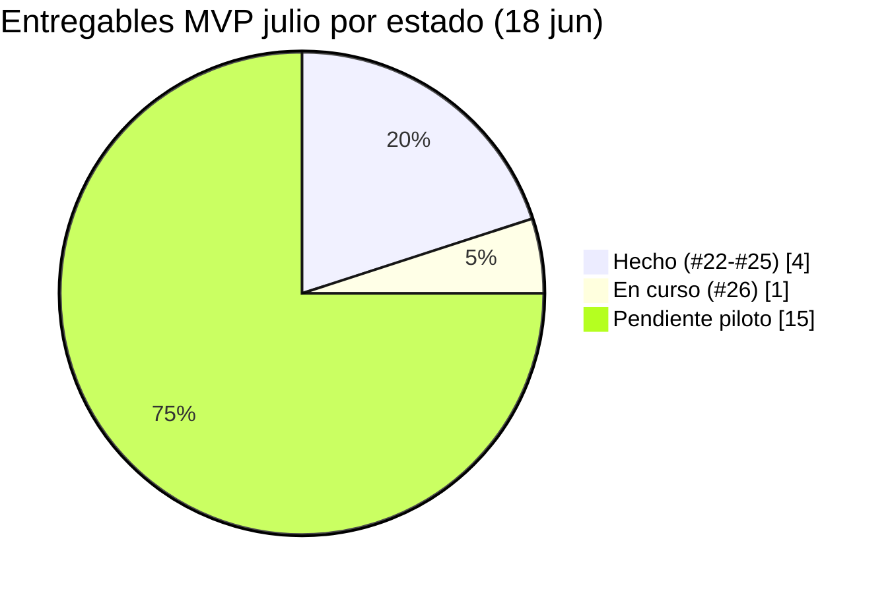

# Roadmap MVP julio — Vista grafica

> **Hoy:** 18 jun 2026 · **Hito piloto:** 31 jul 2026 · **Decision:** [DECISION-002](DECISION-002-mvp-julio-piloto-funcional.md)  
> Plan detallado: [mvp-julio-plan.md](mvp-julio-plan.md)

## Donde estamos ahora

```
Mar 2026          Jun 2026                              Jul 2026              Ago+
|---- SDD/backlog ----|-- Sprint 02 EP-11 --|-- W1..W6 piloto --|-- SDD completo --|
                       ^^^^^^^^^^^^^^^^^^^^^
                       #22-25 HECHO  #26 AHORA
                                              ^
                                         MVP piloto 31 jul
```

| Indicador | Valor |
|-----------|-------|
| **Posicion temporal** | Semana 1 de 6 (18–22 jun) |
| **Issue activa** | **#26** — E2E calidad importacion plano |
| **EP-11 (plano)** | 4/5 issues cerradas (#22–#25) |
| **Progreso piloto (issues)** | ~20 % (4 de ~20 entregables) |
| **Dias hasta piloto** | 43 dias |

**Estado por color:** `HECHO` · `EN CURSO` · `PLANIFICADO` · `POSPILOTO`

---

## Diagrama Gantt (MVP julio)

Copia o visualiza este bloque en GitHub, VS Code o [mermaid.live](https://mermaid.live).



---

## Linea de tiempo por fases



---

## Matriz semanal (estado vivo)

| Semana | Fechas | Entregable clave | Estado |
|--------|--------|------------------|--------|
| **W1** | 18–22 jun | #26 E2E; inicio Excel | **EN CURSO** — estamos aqui |
| W2 | 23–29 jun | Excel #30–31; preferencias | Planificado |
| W3 | 30 jun – 6 jul | Preferencias; #15; evento API | Planificado |
| W4 | 7–13 jul | Invitados API; integracion | Planificado |
| W5 | 14–20 jul | Frontend admin minimo | Planificado |
| W6 | 21–31 jul | Motor v0; piloto real | Planificado |
| Post | ago 2026+ | MVP SDD completo | Pospuesto (SDD intacto) |

---

## Progreso por bloque funcional



| Bloque | Issues | Hecho | En curso | Pendiente |
|--------|--------|-------|----------|-----------|
| Plano EP-11 | #22–#26 | 4 | 1 (#26) | 0 |
| Excel EP-12 | #27–#31 | 0 | 0 | 5 |
| Preferencias EP-13 | #32–#36 | 0 | 0 | 5 |
| Evento EP-01 | #1, #15 | 0 | 0 | 2 |
| Invitados EP-02 | #2 | 0 | 0 | 1 |
| Distribucion piloto | motor v0, E2E | 0 | 0 | 2 |
| UI admin | W5 | 0 | 0 | 1 |

---

## Dos niveles de MVP (referencia rapida)

| Nivel | Fecha objetivo | Que incluye |
|-------|----------------|-------------|
| **MVP julio (piloto)** | **31 jul 2026** | Admin: plano + Excel + evento + invitados + motor v0 + UI minima |
| **MVP SDD completo** | Post-piloto | Todo `SDD-01-borrador-mvp.md` — sin rebaja de requisitos |

---

## Como mantener el roadmap al dia

1. Al cerrar una issue GitHub, actualizar la fila correspondiente en la matriz semanal.
2. Cambiar `#26` por la siguiente issue en la fila **Issue activa** de [CONTEXTO-EJECUCION.md](CONTEXTO-EJECUCION.md).
3. Si cambia el calendario, editar primero `mvp-julio-plan.md` y luego este archivo (fechas Gantt).
4. Para vista interactiva en Cursor, abrir el canvas: `canvases/roadmap-mvp-julio.canvas.tsx` (panel lateral).
