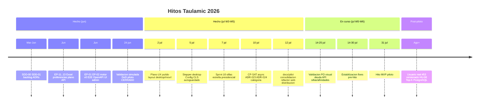
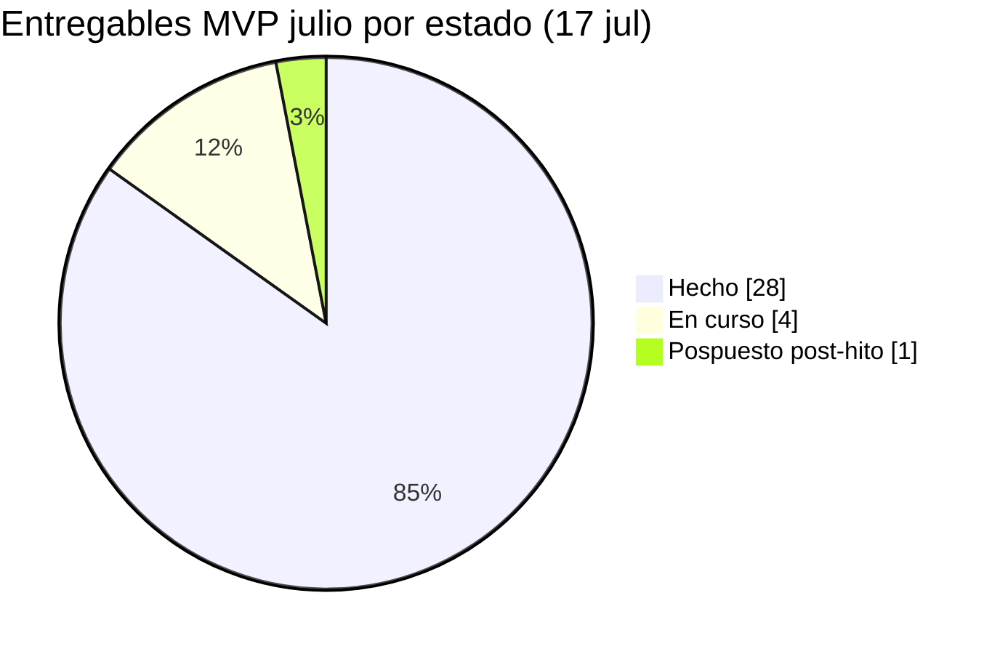

# Roadmap MVP julio — Vista grafica

> **Hoy:** 17 jul 2026 · **Hito piloto:** 31 jul 2026 · **Decision:** [DECISION-002](DECISION-002-mvp-julio-piloto-funcional.md)  
> Plan detallado (historico): [mvp-julio-plan.md](mvp-julio-plan.md) · Estado operativo: [CONTEXTO-EJECUCION.md](CONTEXTO-EJECUCION.md) · Alcance vigente: [docs/pilot/README.md](../pilot/README.md)  
> Commits referencia recientes: `d08d11a` (CP-SAT async) · `9933ce7` (sillas/estrella) · `4dd7e39` (docs/pilot) · `6f242a8` (refactor web)

## Donde estamos ahora

```
Mar 2026          Jun 2026                    Jul 2026 (W5)              31 jul
|---- SDD/backlog ----|-- nucleo piloto HECHO --|-- CP-SAT + cierre --|-- hito --|
                       ^^^^^^^^^^^^^^^^^^^^^^^^^^^
                       EP-11..13 API UI motor E2E HECHO (jun)
                                              ^^^^^^^^^^^^^^^^^^^
                                         W3-W4 plano + sillas + motor CP-SAT
                                                            ^^^^^^^^
                                                       validacion PO + estabilizacion
```

| Indicador | Valor |
|-----------|-------|
| **Posicion temporal** | Semana **W5** de 6 (14–20 jul) — **14 dias al hito** |
| **Foco actual** | Validacion PO visual; deuda sillas/afinidades API; estabilizacion pre-hito |
| **EP-11 / EP-12 / EP-13** | **Cerrados** (#22–#36) |
| **EP-03 Motor CP-SAT async** | **Cerrado** (`d08d11a`; Project #2 Done) |
| **EP-04 / EP-05 / EP-07 / EP-08** | **En curso** (manual HU-05 hecho; PDF parcial; OpenAPI piloto; Top-K pendiente) |
| **Progreso piloto (DoD tecnico)** | **Cerrado** — flujo E2E + docs/pilot consolidados |
| **Usuario real (#53)** | **Pospuesto** post-hito |
| **Dias hasta piloto** | **14 dias** |

**Estado por color:** `HECHO` · `EN CURSO` · `PLANIFICADO` · `POSPILOTO`

---

## Diagrama Gantt (MVP julio)

Copia o visualiza este bloque en GitHub, VS Code o [mermaid.live](https://mermaid.live).

```mermaid
gantt
    title Roadmap Taulamic — MVP julio piloto (actualizado 17 jul 2026)
    dateFormat YYYY-MM-DD
    axisFormat %d %b

    section Preparacion
    SDD backlog ADRs sprints     :done, prep, 2026-03-01, 2026-06-17

    section Backend y API (jun)
    EP-11 plano API #22-26       :done, ep11, 2026-06-01, 2026-06-20
    Excel EP-12 #27-31           :done, ep12, 2026-06-10, 2026-06-18
    Preferencias EP-13 #32-36    :done, ep13, 2026-06-10, 2026-06-18
    Evento mesas EP-01 #1 #15    :done, ep01, 2026-06-08, 2026-06-16
    Invitados API EP-02 #2       :done, ep02, 2026-06-08, 2026-06-16
    Motor v0 distribucion        :done, motor, 2026-06-12, 2026-06-20
    E2E piloto-flow              :done, e2e, 2026-06-15, 2026-06-20
    OpenAPI piloto #9            :done, oapi, 2026-06-12, 2026-06-18

    section Frontend admin (jun)
    UI admin base W5 PR38        :done, w5, 2026-06-10, 2026-06-18
    UI piloto W6 PR39            :done, w6, 2026-06-15, 2026-06-20
    Plano Fase A/B ADR-016       :done, plano, 2026-06-18, 2026-07-02
    Distribucion v2 Dashboard v2 :done, dist, 2026-06-15, 2026-06-20
    Validacion manual guion UI   :done, val, 2026-06-18, 2026-06-24
    Playwright E2E + Sentry prep :done, e2ew, 2026-06-22, 2026-06-24
    Issues post-piloto GitHub    :done, gh, 2026-06-24, 2026-06-24

    section Julio W3-W4 entregas
    Plano UX pulido layout       :done, plano2, 2026-06-25, 2026-07-02
    Stepper PageHeader desktop   :done, stepper, 2026-07-05, 2026-07-05
    Config CLS autoguardado      :done, config, 2026-07-05, 2026-07-05
    Sprint 10 sillas estrella    :done, sillas, 2026-07-01, 2026-07-07
    Afinidades UI reglas edad    :done, affui, 2026-07-01, 2026-07-07

    section Julio W5 motor y docs
    EP-03 CP-SAT async ADR-023   :done, cpsat, 2026-07-01, 2026-07-10
    ADR-024 reparto categoria    :done, cat24, 2026-07-05, 2026-07-10
    Score compatibilidad mesa    :done, score, 2026-07-05, 2026-07-10
    PDF organizador frontend     :done, pdf, 2026-07-07, 2026-07-12
    Docs pilot consolidacion     :done, docp, 2026-07-12, 2026-07-12
    Refactor web distrib/plano   :done, refweb, 2026-07-12, 2026-07-12
    E2E categoria piloto plano   :done, e2ejul, 2026-07-12, 2026-07-17

    section Cierre piloto W5-W6
    API persistencia layout      :active, layout, 2026-06-23, 2026-07-25
    Deuda sillas afinidades API  :crit, deuda, 2026-07-14, 2026-07-28
    Validacion PO visual guion  :active, pov, 2026-07-14, 2026-07-25
    Estabilizacion y fixes       :active, fix, 2026-07-14, 2026-07-30
    Prueba piloto usuario real   :post, test, 2026-08-01, 2026-12-31
    Hito MVP piloto              :milestone, mvp, 2026-07-31, 0d

    section Post-piloto ago+
    HU-05 versionado rico HU-06  :post, 2026-08-01, 2026-10-31
    Drag posiciones mesas ADR-016:post2, 2026-08-01, 2026-10-31
    PostgreSQL auth motor EP-08  :post3, 2026-08-01, 2026-12-31
    Top-K RSVP documentos cocina :post4, 2026-08-01, 2026-12-31
```

---

## Linea de tiempo por fases



---

## Matriz semanal (estado vivo)

| Semana | Fechas | Entregable clave | Estado |
|--------|--------|------------------|--------|
| **W1** | 18–22 jun | Nucleo piloto + refinamiento UX | **HECHO** |
| **W2** | 23–29 jun | Validacion manual; issues post-piloto; cierre DoD | **HECHO** |
| **W3** | 30 jun – 6 jul | Plano UX pulido; stepper; autoguardado Config | **HECHO** |
| **W4** | 7–13 jul | Sprint 10 sillas/estrella; afinidades UI | **HECHO** |
| **W5** | 14–20 jul | CP-SAT async; docs/pilot; refactor web; E2E jul | **EN CURSO** *(hoy 17 jul)* |
| **W6** | 21–31 jul | Validacion PO; estabilizacion; cierre hito 31 jul | **PLANIFICADO** |
| Post | ago 2026+ | Usuario real #53; MVP SDD completo | **Pospuesto** |

---

## Progreso por bloque funcional



| Bloque | Issues / ambito | Hecho | En curso | Pendiente |
|--------|-----------------|-------|----------|-----------|
| Plano EP-11 | #22–#26 + ADR-016 UI | Fase A/B + UX jul | persistencia layout API | drag accesorios `(x,y)` |
| Excel EP-12 | #27–#31 | 5 | — | — |
| Preferencias EP-13 | #32–#36 | 5 API | UI afinidades | persistencia API reglas |
| Evento EP-01 | #1, #15 | 2 | — | — |
| Invitados EP-02 | #2 + UI manual | 1 + UI | — | — |
| Distribucion | CP-SAT async ADR-023/024 | motor + score + async | — | Top-K (post-piloto) |
| Distribucion UI | sillas estrella refactor | Sprint 10 + `6f242a8` | validacion PO | unificar sillas API |
| Validacion + E2E | guion + Playwright | piloto + categoria + plano movil | PO visual pendiente | — |
| Docs | ADR pilot TRAZABILIDAD | `docs/pilot/` `4dd7e39` | — | — |
| Documentos EP-05 | PDF organizador | frontend parcial HU-08 | cocina/publicacion | persistencia backend |

---

## Dos niveles de MVP (referencia rapida)

| Nivel | Fecha objetivo | Que incluye |
|-------|----------------|-------------|
| **MVP julio (piloto)** | **31 jul 2026** | Admin completo + **CP-SAT v1** + distribucion por sillas + PDF parcial — ver [`docs/pilot/`](../pilot/README.md) |
| **MVP SDD completo** | Post-piloto | Todo `SDD-01-borrador-mvp.md` — sin rebaja de requisitos |

---

## Como mantener el roadmap al dia

1. Al cerrar una issue GitHub o merge relevante, actualizar la matriz semanal y barras `done` del Gantt.
2. Sincronizar foco activo con [CONTEXTO-EJECUCION.md](CONTEXTO-EJECUCION.md).
3. Si cambia el calendario, editar primero `mvp-julio-plan.md` y luego este archivo (fechas Gantt).
4. Cumplimiento piloto vs SDD-01: `docs/sdd/SDD-PILOTO-alineacion-y-huecos.md`.
