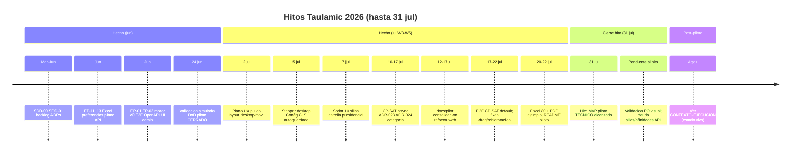
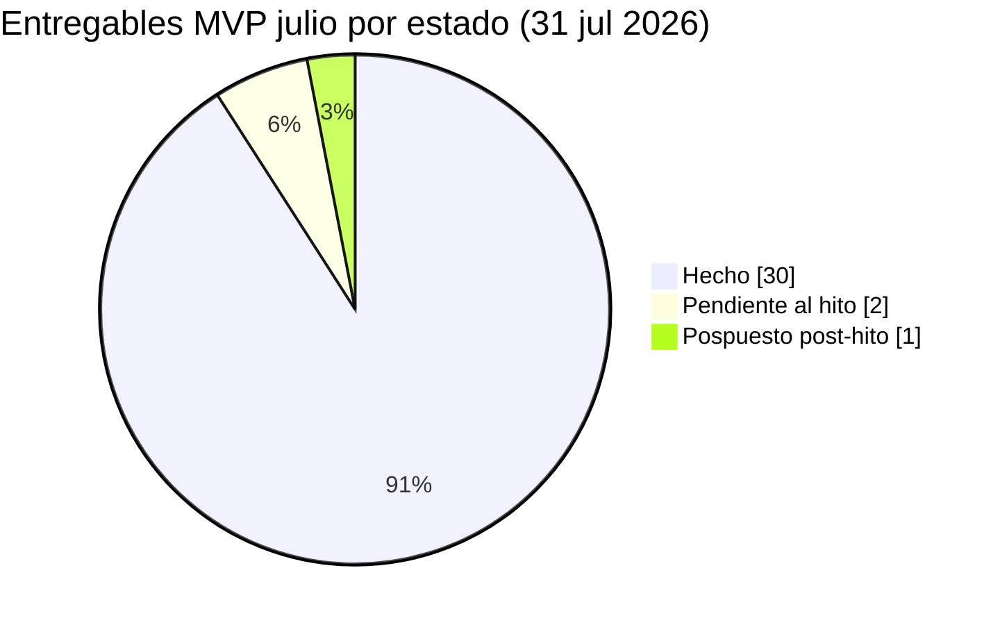

# Roadmap MVP julio — Vista grafica

> **Snapshot:** cierre del hito julio · **Fecha del documento:** 31 jul 2026  
> **Hito piloto:** 31 jul 2026 · **Decision:** [DECISION-002](DECISION-002-mvp-julio-piloto-funcional.md)  
> Plan detallado (historico): [mvp-julio-plan.md](mvp-julio-plan.md) · **Estado vivo (ago+):** [CONTEXTO-EJECUCION.md](CONTEXTO-EJECUCION.md) · Alcance: [docs/pilot/README.md](../pilot/README.md)  
> Commits referencia fin julio: `3447809` (ADR-024) · `6f242a8` / refactor distribucion · `4dd7e39` (docs/pilot) · `d08d11a` (CP-SAT async) · `9933ce7` (sillas/estrella) · fixes UX distribucion (`9ec7629`, `c5601be`) · material demo (`83ca637`)

Este archivo describe el **MVP julio hasta el 31 jul**. No incorpora el trabajo de agosto 2026 en adelante (issues #54–#60, BF-09…13, etc.): eso vive en CONTEXTO y el backlog post-piloto.

## Donde estabamos al cierre (31 jul 2026)

```
Mar 2026          Jun 2026                    Jul 2026                         31 jul
|---- SDD/backlog ----|-- nucleo piloto HECHO --|-- CP-SAT + cierre W5-W6 --|-- hito --|
                       ^^^^^^^^^^^^^^^^^^^^^^^^^^^
                       EP-11..13 API UI motor E2E HECHO (jun)
                                              ^^^^^^^^^^^^^^^^^^^^^^^^^^^^
                                         W3-W5 entregas + estabilizacion W6
                                                            ^^^^^^^^
                                              hito tecnico CERRADO; PO visual pendiente
```

| Indicador | Valor (31 jul) |
|-----------|----------------|
| **Posicion temporal** | **Fin W6** — hito **31 jul** alcanzado en alcance tecnico |
| **Foco al cierre** | Piloto evaluable documentado; estabilizacion UX distribucion; material demo (Excel 80 + PDF ejemplo) |
| **EP-11 / EP-12 / EP-13** | **Cerrados** (#22–#36) en nucleo; afinidades UI hecha, persistencia API reglas **pendiente** |
| **EP-03 Motor CP-SAT async** | **Cerrado** (`d08d11a` + ADR-024 `3447809`) |
| **ADR-024 / Fase 1a·1b** | **Hecho en codigo** (17 jul) — L3bis, k_min C+E, exclusion Pareja |
| **EP-04 / EP-05 / EP-07 / EP-08** | Manual HU-05 hecho; PDF parcial; OpenAPI piloto; Top-K **post-piloto** |
| **Progreso piloto (DoD tecnico)** | **Cerrado** — flujo E2E + `docs/pilot/` consolidados |
| **Validacion PO visual** | **Pendiente** al 31 jul (guion) — sigue abierta post-hito |
| **Deuda sillas / afinidades API** | **Pendiente** al 31 jul (luego #55 en ago) |
| **Usuario real (#53)** | **Pospuesto** post-hito |
| **Dias hasta piloto** | **0** (hito alcanzado) |

**Estado por color:** `HECHO` · `EN CURSO` · `PENDIENTE_AL_HITO` · `POSPILOTO`

---

## Diagrama Gantt (MVP julio)

Copia o visualiza este bloque en GitHub, VS Code o [mermaid.live](https://mermaid.live).

```mermaid
gantt
    title Roadmap Taulamic — MVP julio piloto (snapshot 31 jul 2026)
    dateFormat YYYY-MM-DD
    axisFormat %d %b

    section Preparacion
    SDD backlog ADRs sprints     :done, prep, 2026-03-01, 2026-06-17

    section Backend y API (jun)
    EP-11 plano API #22-26       :done, ep11, 2026-06-01, 2026-06-20
    Excel EP-12 #27-31           :done, ep12, 2026-06-10, 2026-06-18
    Preferencias EP-13 #32-36    :done, ep13, 2026-06-10, 2026-06-18
    Evento mesas EP-01 #1 #15    :done, ep01, 2026-06-08, 2026-06-16
    Invitados API EP-02 #2       :done, ep02, 2026-06-08, 2026-06-16
    Motor v0 distribucion        :done, motor, 2026-06-12, 2026-06-20
    E2E piloto-flow              :done, e2e, 2026-06-15, 2026-06-20
    OpenAPI piloto #9            :done, oapi, 2026-06-12, 2026-06-18

    section Frontend admin (jun)
    UI admin base W5 PR38        :done, w5, 2026-06-10, 2026-06-18
    UI piloto W6 PR39            :done, w6, 2026-06-15, 2026-06-20
    Plano Fase A/B ADR-016       :done, plano, 2026-06-18, 2026-07-02
    Distribucion v2 Dashboard v2 :done, dist, 2026-06-15, 2026-06-20
    Validacion manual guion UI   :done, val, 2026-06-18, 2026-06-24
    Playwright E2E + Sentry prep :done, e2ew, 2026-06-22, 2026-06-24
    Issues post-piloto GitHub    :done, gh, 2026-06-24, 2026-06-24

    section Julio W3-W4 entregas
    Plano UX pulido layout       :done, plano2, 2026-06-25, 2026-07-02
    Stepper PageHeader desktop   :done, stepper, 2026-07-05, 2026-07-05
    Config CLS autoguardado      :done, config, 2026-07-05, 2026-07-05
    Sprint 10 sillas estrella    :done, sillas, 2026-07-01, 2026-07-07
    Afinidades UI reglas edad    :done, affui, 2026-07-01, 2026-07-07

    section Julio W5 motor y docs
    EP-03 CP-SAT async ADR-023   :done, cpsat, 2026-07-01, 2026-07-10
    ADR-024 reparto categoria    :done, cat24, 2026-07-05, 2026-07-17
    Score compatibilidad mesa    :done, score, 2026-07-05, 2026-07-10
    PDF organizador frontend     :done, pdf, 2026-07-07, 2026-07-12
    Docs pilot consolidacion     :done, docp, 2026-07-12, 2026-07-12
    Refactor web distribucion    :done, refweb, 2026-07-12, 2026-07-17
    E2E CP-SAT por defecto       :done, e2ecp, 2026-07-17, 2026-07-17
    Material demo Excel+PDF      :done, demo, 2026-07-20, 2026-07-22

    section Cierre piloto W5-W6
    Estabilizacion UX distribucion :done, fix, 2026-07-14, 2026-07-22
    keepTogether UX + JWT nota     :done, kt, 2026-07-22, 2026-07-22
    Hito MVP piloto tecnico        :milestone, mvp, 2026-07-31, 0d
    Validacion PO visual guion     :crit, pov, 2026-07-14, 2026-07-31
    Deuda sillas afinidades API    :crit, deuda, 2026-07-14, 2026-07-31
    Persistencia layout API dual   :done, layout, 2026-06-23, 2026-07-25

    section Post-piloto ago+
    Prueba piloto usuario real   :post, test, 2026-08-01, 2026-12-31
    HU-05 versionado rico HU-06  :post, 2026-08-01, 2026-10-31
    Drag posiciones mesas ADR-016:post2, 2026-08-01, 2026-10-31
    PostgreSQL auth motor EP-08  :post3, 2026-08-01, 2026-12-31
    Top-K RSVP documentos cocina :post4, 2026-08-01, 2026-12-31
```

---

## Linea de tiempo por fases


```mermaid
timeline
    title Hitos Taulamic 2026 (hasta 31 jul)
    section Hecho (jun)
        Mar-Jun : SDD-00 SDD-01 backlog ADRs
        Jun : EP-11..13 Excel preferencias plano API
        Jun : EP-01 EP-02 motor v0 E2E OpenAPI UI admin
        24 jun : Validacion simulada DoD piloto CERRADO
    section Hecho (jul W3-W5)
        2 jul : Plano UX pulido layout desktop/movil
        5 jul : Stepper desktop Config CLS autoguardado
        7 jul : Sprint 10 sillas estrella presidencial
        10-17 jul : CP-SAT async ADR-023 ADR-024 categoria
        12-17 jul : docs/pilot consolidacion refactor web
        17-22 jul : E2E CP-SAT default; fixes drag/rehidratacion
        20-22 jul : Excel 80 + PDF ejemplo; README piloto
    section Cierre hito (31 jul)
        31 jul : Hito MVP piloto TECNICO alcanzado
        Pendiente al hito : Validacion PO visual; deuda sillas/afinidades API
    section Post-piloto
        Ago+ : Ver CONTEXTO-EJECUCION (estado vivo)
```

---

## Matriz semanal (julio, cerrada)

| Semana | Fechas | Entregable clave | Estado al 31 jul |
|--------|--------|------------------|------------------|
| **W1** | 18–22 jun | Nucleo piloto + refinamiento UX | **HECHO** |
| **W2** | 23–29 jun | Validacion manual; issues post-piloto; cierre DoD | **HECHO** |
| **W3** | 30 jun – 6 jul | Plano UX pulido; stepper; autoguardado Config | **HECHO** |
| **W4** | 7–13 jul | Sprint 10 sillas/estrella; afinidades UI | **HECHO** |
| **W5** | 14–20 jul | CP-SAT async; ADR-024; docs/pilot; refactor; E2E | **HECHO** |
| **W6** | 21–31 jul | Estabilizacion UX; material demo; **hito tecnico** | **HECHO** (PO visual y deuda sillas API = **PENDIENTE_AL_HITO**) |
| Post | ago 2026+ | Usuario real #53; MVP SDD completo; ver CONTEXTO | **Pospuesto / vivo en CONTEXTO** |

---

## Progreso por bloque funcional (31 jul)


```mermaid
pie showData
    title Entregables MVP julio por estado (31 jul 2026)
    "Hecho" : 30
    "Pendiente al hito" : 2
    "Pospuesto post-hito" : 1
```

| Bloque | Issues / ambito | Hecho (jul) | Pendiente al hito | Post-piloto |
|--------|-----------------|-------------|-------------------|-------------|
| Plano EP-11 | #22–#26 + ADR-016 UI | Fase A/B + UX jul; dual write layout | — | drag accesorios `(x,y)` rico |
| Excel EP-12 | #27–#31 | 5 + demo 80 filas | — | — |
| Preferencias EP-13 | #32–#36 | 5 API + UI afinidades + keepTogether UX | persistencia API reglas; CRUD keepTogether duro | — |
| Evento EP-01 | #1, #15 | 2 + date picker propio | — | — |
| Invitados EP-02 | #2 + UI manual | 1 + UI | — | — |
| Distribucion | CP-SAT async ADR-023/024 | motor + score + async + swap mesas | — | Top-K; deuda L2 mesas justas (ago #54) |
| Distribucion UI | sillas estrella refactor | Sprint 10 + refactor + fixes jul | validacion PO; unificar sillas API | — |
| Validacion + E2E | guion + Playwright | piloto + categoria + plano movil + CP-SAT default | **PO visual** | — |
| Docs | ADR pilot TRAZABILIDAD | `docs/pilot/` + README ampliado | — | — |
| Documentos EP-05 | PDF organizador | frontend parcial HU-08 + PDF ejemplo | cocina/publicacion | persistencia backend |

---

## Dos niveles de MVP (referencia rapida)

| Nivel | Fecha objetivo | Que incluye |
|-------|----------------|-------------|
| **MVP julio (piloto)** | **31 jul 2026** | Admin completo + **CP-SAT v1** + distribucion por sillas + PDF parcial — ver [`docs/pilot/`](../pilot/README.md). Hito **tecnico** cerrado; PO visual y unificacion sillas API quedaron abiertas. |
| **MVP SDD completo** | Post-piloto | Todo `SDD-01-borrador-mvp.md` — sin rebaja de requisitos |

---

## Como mantener este documento

1. Este archivo es el **snapshot del hito julio**. No lo uses como “donde estamos hoy” tras ago 2026.
2. Estado operativo vivo: [CONTEXTO-EJECUCION.md](CONTEXTO-EJECUCION.md).
3. Si solo corriges hechos de julio (fechas/commits), actualiza Gantt y matriz; no mezcles entregas de agosto sin renombrar el documento.
4. Cumplimiento piloto vs SDD-01: `docs/sdd/SDD-PILOTO-alineacion-y-huecos.md`.
