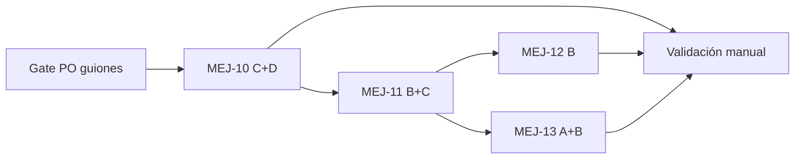

# Sprint 07 — Cohesión UX piloto (MEJ-10 → MEJ-13)

> **Inicio:** 2026-06-21  
> **Contexto:** Sprint 06 cerrado (`sprint-06-cierre.md`, `main` @ `36e889d`).  
> **SDD manda** — mejoras UX sin cambio de alcance funcional salvo aprobación PO explícita.

## 0) Gate obligatorio (Día 0)

**No codificar MEJ-10/11/12/13** hasta sesión PO con guiones de propuesta:

| MEJ | Guion |
|-----|-------|
| MEJ-10 | `guion-validacion-mej-10-propuesta-ui.md` |
| MEJ-11 | `guion-validacion-mej-11-propuesta-ui.md` |
| MEJ-12 | `guion-validacion-mej-12-propuesta-ui.md` |
| MEJ-13 | `guion-validacion-mej-13-propuesta-microcopy.md` |

Sesión recomendada: **una sola revisión** (~45 min) o dos bloques (10+11 · 12+13).

---

## 1) Objetivo

Pulir la experiencia del **organizador en piloto bodas**: cohesión visual (feedback, chips, tablas), dashboard como carta de navegación del proyecto, plano legible con muchas mesas, y microcopy honesto sin ruido.

---

## 2) Pre-trabajo ya en `main` (fuera del sprint, no repetir)

| Commit | Entrega |
|--------|---------|
| `bab758c` | Superficies opacas feedback (`feedback-surface-*`) — parcial MEJ-10-B |
| `d5bd3da` | Responsive distribución (`lg` + sidebar) |
| `3841a29` | Footer setup: fila fija, flechas `< md` |
| `36e889d` | Siguiente a la derecha sin Anterior (Config) |
| `b05b1d7` | Landing: segmentos Aula/Empresa «Próximamente» |

Documentación MEJ-10…13 ya en repo; specs son la base del sprint.

---

## 3) Alcance

| Prioridad | MEJ | Fase | Descripción | Estado |
|-----------|-----|------|-------------|--------|
| **P0** | — | Gate PO | Aprobar guiones propuesta MEJ-10…13 | ✅ 2026-06-21 |
| **P1** | MEJ-10 | A | §7.5 feedback contextual + árbol decisión en guía | ✅ |
| **P1** | MEJ-10 | C | Mesas: error inline rename + `ConfirmDialog` eliminar | ✅ `4890625` |
| **P1** | MEJ-10 | D | Chips filtro: variante canónica única | ✅ `4890625` |
| **P1** | MEJ-11 | B | Dashboard CTA contextual (Config / siguiente paso) | ✅ `8a79138` |
| **P1** | MEJ-11 | C | Checklist setup clicable | ✅ `4890625` |
| **P2** | MEJ-11 | D | Accesos rápidos responsive (`lg:hidden` u opción PO) | ✅ Eliminados (decisión PO) |
| **P2** | MEJ-12 | B | Marcadores compactos plano Fase B (~44 px) | ✅ `fdc8373` |
| **P2** | MEJ-13 | A | Inventario microcopy (`inventario-microcopy-ui.md`) + decisiones PO | ✅ |
| **P2** | MEJ-13 | B | Poda ayudas acordadas (piloto / post-MVP redundantes) | ✅ `1d3db89` |
| **P3** | MEJ-13 | C | Etiquetas botón cortas `< md` (p. ej. Confirmar) | ✅ `1d3db89` |
| Stretch | MEJ-10 | E–F | Tablas thead unificado; targets táctiles pills | ⏭️ Si sobra tiempo |
| Stretch | MEJ-12 | C | Grid auto / zoom canvas | ⏭️ Post-piloto preferible |
| — | — | Validación | Guiones post-implementación + cierre sprint | ⏳ Pendiente |

---

## 4) Fuera de alcance Sprint 07

| Exclusión | Referencia |
|-----------|------------|
| RF-HU05-03.6 asientos S1…Sn (Fase C) | Backlog HU-05 |
| Drag posiciones mesas en canvas | ADR-016 post-MVP |
| #53 Organizador real / auth / PostgreSQL | Pospuesto |
| UI historial auditoría HU-05 | Log API suficiente |
| Motor afinidad consume reglas | Post-piloto |
| Lista eventos / multi-proyecto | MEJ-11 fuera alcance |
| Marketing: Precios / Blog / Sobre nosotros | Hecho parcial (`b05b1d7`); ampliar post-piloto |

---

## 5) Orden de implementación recomendado

1. **MEJ-10 C+D** — impacto transversal bajo riesgo funcional  
2. **MEJ-11 B+C** — mayor valor PO (Config = proyecto)  
3. **MEJ-12 B** — plano con eventos grandes  
4. **MEJ-13 A** antes de **B/C** — no podar copy sin inventario firmado  

---

## 6) Criterios de aceptación (resumen)

### MEJ-10
- Error renombrar mesa vacía/duplicada: inline bajo input, no toast error.
- Eliminar mesa con invitados: `ConfirmDialog`, no `window.confirm`.
- Chips filtro misma variante en Distribución, plano e Invitados (decisión PO en guion §D).

### MEJ-11
- Evento nuevo: CTA visible → `/config` antes que invitados.
- Checklist: filas desbloqueadas navegan al paso setup.
- Sin regresión KPIs live (MEJ-08 PP-HU05-04).

### MEJ-12
- Chip mesa ≤50 px; color ocupación coherente; 1 clic → panel; DnD pills OK.

### MEJ-13
- Cada string del inventario con decisión PO documentada.
- Límites reales (Tarjetas, colaborativo) siguen visibles.
- Botones cortos móvil con `aria-label` completo.

Detalle en specs MEJ y guiones post-implementación.

---

## 7) Validación y tests

| Tipo | Qué |
|------|-----|
| Manual | `guion-validacion-mej-10-ui.md`, `-11-ui.md`, `-12-ui.md`, `-13-ui.md` |
| Regresión | E2E `distribution.e2e-spec`, `pilot-flow.spec.ts` tras MEJ-10/11 |
| Smoke | Footer setup (Config, Distribución), dashboard CTA, plano 12+ mesas prueba |

Política: `docs/agile/politica-validacion-tests-y-cobertura.md`

---

## 8) Criterio de cierre Sprint 07

- [ ] Gate PO: guiones propuesta MEJ-10…13 aprobados (total o parcial anotado en specs)
- [ ] P1 entregado y validado manualmente
- [ ] P2 entregado **o** explícitamente diferido con motivo en `sprint-07-cierre.md`
- [ ] `sprint-07-cierre.md` + `CONTEXTO-EJECUCION.md` actualizados
- [ ] Evidencias en `evidencias-mej-10-validacion.md` (y 11/12/13 según alcance)
- [ ] Opcional: repaso `guion-validacion-piloto-ui.md` con flujo bodas completo

---

## 9) Referencias

| Documento | Uso |
|-----------|-----|
| `MEJ-10-cohesion-ui-feedback-y-tablas.md` | Spec cohesión UI |
| `MEJ-11-dashboard-navegacion-y-atajos.md` | Spec dashboard |
| `MEJ-12-plano-marcadores-compactos.md` | Spec plano |
| `MEJ-13-auditoria-microcopy-y-ayudas.md` | Spec copy |
| `guia-estilo-taulamic.md` | §7 feedback · §9 Dashboard · § Plano · §11 Microcopy |
| `sprint-06-cierre.md` | Sprint anterior |
| `ADR-018` | Flujo setup |
| `ADR-019` | Responsive admin |

---

## 10) Historial

| Fecha | Evento |
|-------|--------|
| 2026-06-21 | Plan Sprint 07 creado |
