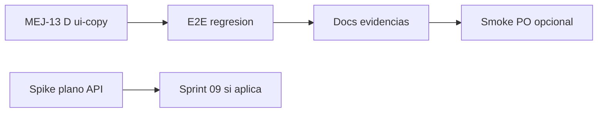

# Sprint 08 — Estabilización piloto y deuda UX (post Sprint 07)

> **Inicio propuesto:** 2026-06-21  
> **Contexto:** Sprint 07 cerrado (`sprint-07-cierre.md`, `main` @ `a35a86d`).  
> **SDD manda** — sin rebaja de alcance funcional salvo aprobación PO explícita.

## 1) Objetivo

Consolidar el piloto bodas antes del hito **31 jul 2026**: centralizar microcopy acordado (MEJ-13 D), cerrar huecos técnicos del plano si aplica, y mantener regresión E2E verde.

---

## 2) Alcance propuesto

| Prioridad | ID | Descripción | Estado |
|-----------|-----|-------------|--------|
| **P1** | MEJ-13-D | `lib/ui-copy.ts` + cableado strings inventario | ✅ Implementado (pendiente cierre) |
| **P2** | — | Repaso manual `guion-validacion-piloto-ui.md` (evidencias) | ⏳ Opcional |
| **P2** | — | Roadmap W3: revisión huecos plano (`SDD-PILOTO-alineacion-y-huecos.md` §107) | ⏳ Spike |
| **P3** | — | API persistencia layout salón Fase A | ⏳ Diferido — requiere diseño API |
| **P3** | — | Fondo canvas + accesorios drag (ADR-016 post-piloto) | ⏳ Fuera julio |
| — | #53 | Organizador real | ⏳ Pospuesto post-piloto |

---

## 3) MEJ-13 D — criterios de aceptación

1. Archivo `apps/web/src/lib/ui-copy.ts` con strings del inventario §1–§3 (save status, setup nav, distribución, piloto).
2. Componentes cableados: `SaveStatusIndicator`, `SetupNavBar`, Config/Invitados/Mesas/Plano hints, Distribución botones responsive.
3. E2E `pilot-flow.spec.ts` usa constantes de copy crítico (autoguardado, hints).
4. Sin regresión visual; `inventario-microcopy-ui.md` §5 actualizado.
5. Validación manual ligera PO (smoke copy en Config + Distribución).

---

## 4) Fuera de alcance Sprint 08

| Exclusión | Referencia |
|-----------|------------|
| PostgreSQL / auth JWT | Post-piloto MVP SDD |
| Motor EP-08 / Top-K operativo | Post-piloto |
| Drag posiciones mesas canvas | ADR-016 post-MVP |
| RF-HU05-03.6 asientos S1…Sn | Backlog HU-05 |
| Marketing ampliado | Post-piloto |

---

## 5) Orden de implementación

---

## 6) Validación

| Tipo | Comando / guion |
|------|-----------------|
| Web E2E | `cd apps/web && npm run test:e2e` |
| Web build | `cd apps/web && npm run build` |
| Manual | `guion-validacion-piloto-ui.md` (opcional) |
| MEJ-13 smoke | Revisar Config + Distribución `< md` |

Política: `docs/agile/politica-validacion-tests-y-cobertura.md`

---

## 7) Criterio de cierre Sprint 08

- [ ] MEJ-13 D entregado y documentado
- [ ] E2E `pilot-flow.spec.ts` 3/3 verde
- [ ] `sprint-08-cierre.md` + `CONTEXTO-EJECUCION.md` actualizados
- [ ] Spike plano API anotado (sí/no para Sprint 09)
- [ ] Opcional: sesión manual piloto con evidencias

---

## 8) Referencias

| Documento | Uso |
|-----------|-----|
| `sprint-07-cierre.md` | Sprint anterior |
| `MEJ-13-auditoria-microcopy-y-ayudas.md` | Spec Fase D |
| `inventario-microcopy-ui.md` | Matriz strings |
| `roadmap-mvp-julio.md` | Calendario W3–W6 |
| `SDD-PILOTO-alineacion-y-huecos.md` | Huecos técnicos |

---

## 9) Historial

| Fecha | Evento |
|-------|--------|
| 2026-06-21 | Plan Sprint 08 creado (post cierre S07 + E2E A–G) |
