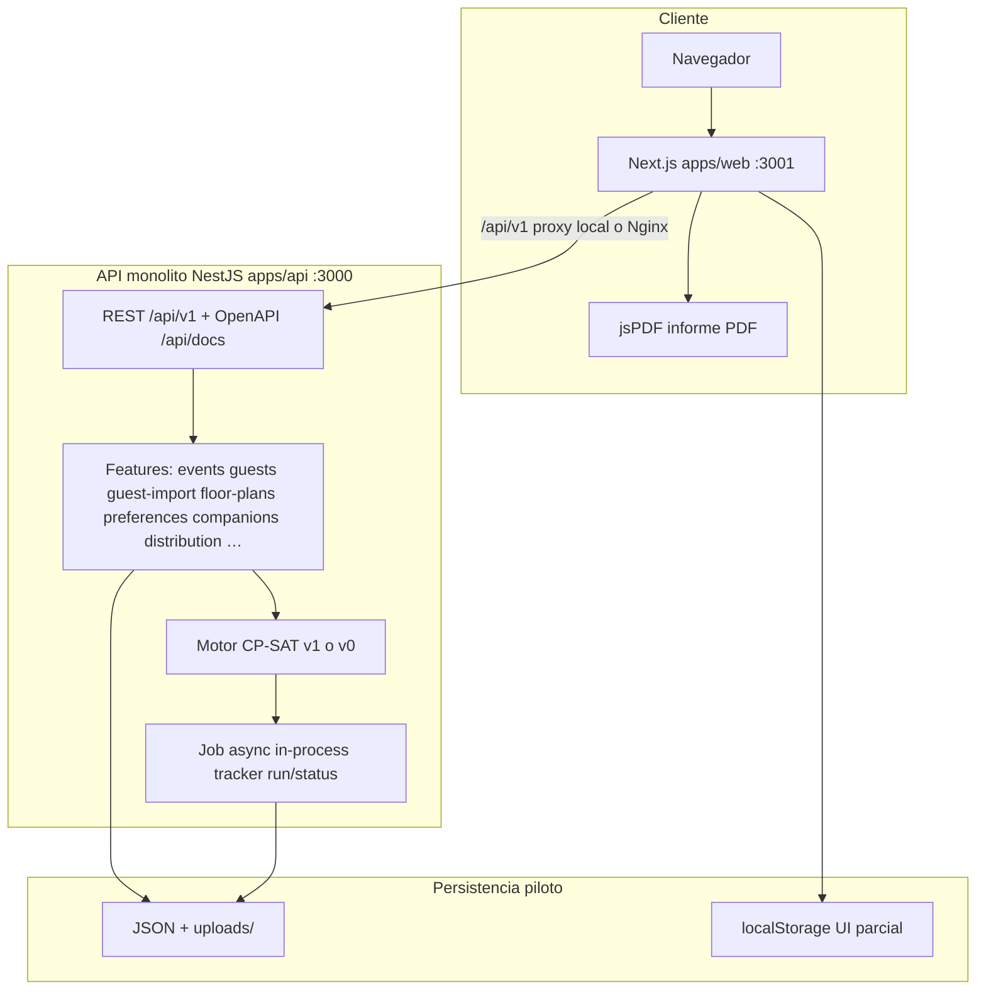
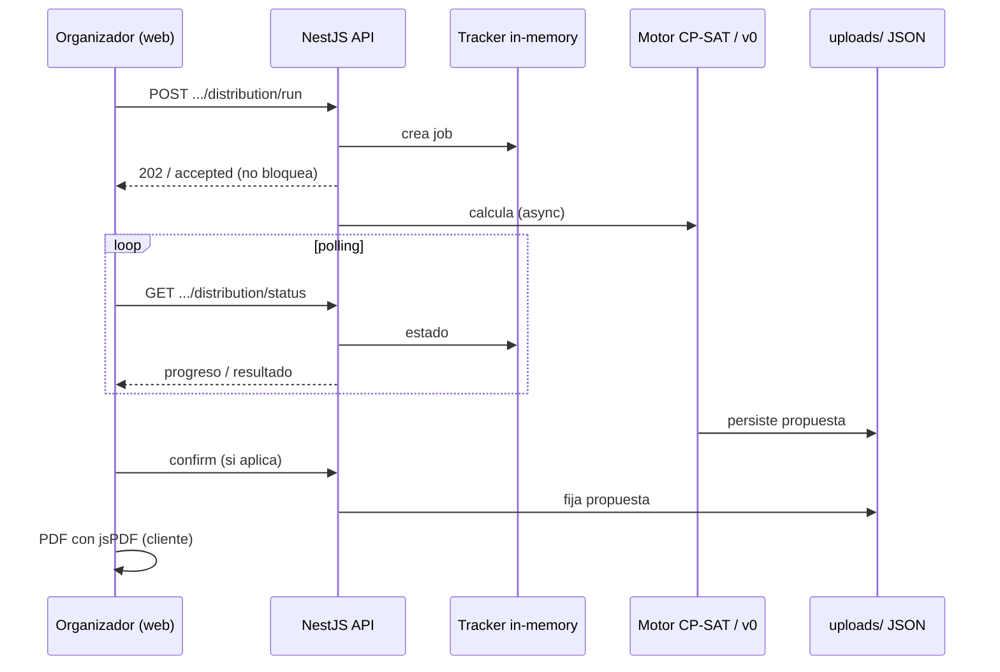
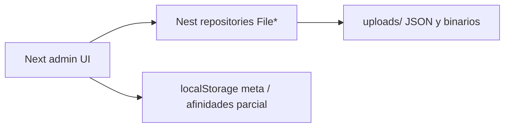
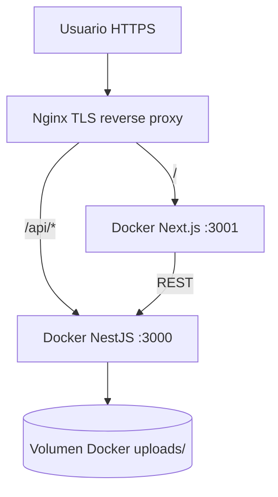

# Arquitectura operativa del piloto

Visión corta de **cómo corre Taulamic hoy** (código del piloto), no la arquitectura objetivo a largo plazo. Para alcance funcional ver [`../pilot/ALCANCE-ACTUAL.md`](../pilot/ALCANCE-ACTUAL.md).

Última revisión documental: **2026-08-06**. Este documento **no** se regenera en CI; se actualiza a mano cuando cambie el runtime.

Los diagramas usan [Mermaid](https://mermaid.live) (GitHub / VS Code los renderizan).

---

## Vista de bloques



Equivalente en texto:

```text
Navegador (Next.js :3001)
    │  /api/v1  (proxy en local y en Nginx)
    ▼
API NestJS (:3000)  ·  prefijo api/v1  ·  OpenAPI /api/docs
    │
    ├── Módulos por feature (events, guests, guest-import, floor-plans, …)
    ├── Persistencia piloto: JSON (+ uploads/) bajo uploads/
    └── Motor (proceso API): CP-SAT (v1) o v0 → job async in-memory
```

- **Frontend:** panel organizador en `apps/web` (actor admin por cabecera interna; sin login de producto en el piloto).
- **Backend:** monolito NestJS en `apps/api` (ADR-002 / ADR-015: features con capas pragmáticas).
- **Contrato:** OpenAPI generado desde decoradores Nest; copia versionada en [`../api/openapi.json`](../api/openapi.json).

---

## Flujo de distribución (lo crítico)



1. El cliente llama `POST .../distribution/run` con invitados, mesas, preferencias y reglas blandas del payload.
2. La API acepta el trabajo y responde de forma no bloqueante; el progreso se consulta con `GET .../distribution/status`.
3. El motor **v1 (CP-SAT)** resuelve en fases (mesa y asiento; ver ADR-023). Si `DISTRIBUTION_ENGINE=v0`, se usa el greedy de piloto.
4. El resultado queda persistido; `confirm` fija la propuesta. El PDF del informe se genera en el **navegador** (jsPDF), no en la API.

**Async en el piloto:** el tracker del job vive en **memoria del proceso** Node. No hay cola externa (BullMQ u otra). Reiniciar el contenedor/API pierde jobs en curso; resultados ya persistidos en JSON sí sobreviven si el volumen `uploads/` se mantiene.

---

## Persistencia



| Qué | Dónde (piloto) |
|-----|----------------|
| Eventos, mesas, invitados, distribución, planos, preferencias API… | Repositorios JSON bajo `apps/api/uploads/` (volumen Docker en prod) |
| Metadatos UI / afinidades configuradas en pantalla (parcial) | También `localStorage` en el cliente (limitación documentada en ALCANCE) |
| Plano / ficheros binarios | `uploads/` |

No hay base SQL en el piloto evaluable.

---

## Despliegue operativo (resumen)



- Compose en el host: API y web en contenedores; Nginx termina HTTPS y enruta `/` → web, `/api/*` → API.
- Timeout de proxy amplio: el cálculo CP-SAT puede durar minutos.
- Detalle de pasos: sección **Despliegue del piloto** en el README de la raíz.

Variables relevantes (ver también `apps/api/.env.example`):

- `PORT`, `DISTRIBUTION_ENGINE` (`v1` | `v0`)
- `SENTRY_DSN` (opcional)

---

## Qué no es este documento

- No sustituye ADRs ni el SDD.
- No describe Top-K, auth JWT de producto ni multi-tenant (fuera del piloto o pospuestos).
- No es la arquitectura objetivo con worker/BullMQ/PostgreSQL (ADR-002/003; ver BF-09…13 en backlog post-piloto).
- Para evolución del alcance: [`../pilot/EVOLUCION-DEL-ALCANCE.md`](../pilot/EVOLUCION-DEL-ALCANCE.md).
